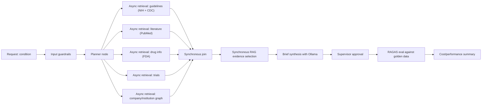

# Architecture

## Execution Model

Retrieval nodes are asynchronous because external APIs and knowledge bases are latency-bound. The join, RAG selection, synthesis, approval, and evaluation path is synchronous to preserve ordered controls and auditable state transitions.

### Live evidence sources

`ExternalRetrievalService` (`backend/app/retrieval/external.py`) calls real public APIs, split by evidence type:

- **NIH** (MedlinePlus) and **CDC** (Content Syndication API) — treatment and diagnosis guidance (`guideline` source type).
- **PubMed** (NCBI E-utilities) — peer-reviewed literature for grounded research citations (`literature` source type).
- **FDA** (openFDA drug labels) — approved drug indications for citation-backed drug information (`drug_label` source type).

Each provider call is wrapped so that any failure (timeout, rate limit, network unavailable) silently falls back to a deterministic offline fixture for that provider, and an `live_fetch_fallback` audit event records which providers degraded. This keeps the briefing pipeline available even when a government API is down, while making degraded runs visible in the audit trail. Set `USE_LIVE_EXTERNAL_APIS=false` to force fully offline fixtures (e.g. for air-gapped demos or CI).

## State Reduction

Graph state carries compact references:

- Evidence ID
- Source type
- Short title
- Trust tier
- Retrieval score

Raw documents, chunks, and embeddings live in the evidence store. Synthesis nodes fetch only the selected chunks on demand.

## Governance

- Guardrails block personal-medical-advice prompts and unsafe output.
- Supervisor validates grounding, source diversity, investigational/approved distinction, and strategic framing.
- Audit events are emitted at every node with run ID, node name, and compact payload.
- Evaluation runs only after supervisor approval.

## Cost and Performance Controls

- Async fan-out minimizes wall-clock retrieval latency.
- Evidence compression prevents prompt bloat.
- RAG top-k is bounded by section.
- LLM calls are centralized behind a budget-aware client.
- Fallback offline providers keep demos functional when external APIs are unavailable.
